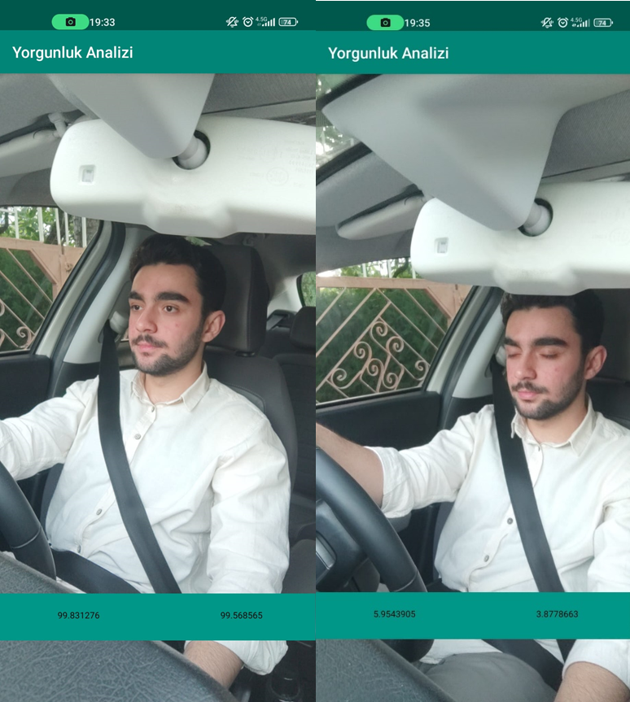

# DriverFatigueAlert
This project is a mobile application for android that analyzes the eye opening value of the driver and gives a warning at the time of fatigue. Aperture values were found using ML Kit libraries.

## Real Time
This application does not analyze a photo or video. It allows you to analyze your image in real time.
## High Accuracy
Thanks to the ML Kit Library, the aperture values of the eyes are determined with high accuracy.
## Quick Analysis
The aperture values of the eye are calculated quickly and the necessary warning is given.

### ML Kit 

It is a library for implementing machine learning features in mobile apps, developed by Google. It provides ready-to-use APIs for tasks like image recognition, text recognition, face detection, barcode scanning, and more.

### CameraView Library 

It is a library for Android that provides an easy-to-use and customizable camera implementation. It simplifies the process of capturing photos and videos, and it offers features like camera preview, image cropping, zooming, and various customization options for camera behavior and UI.
